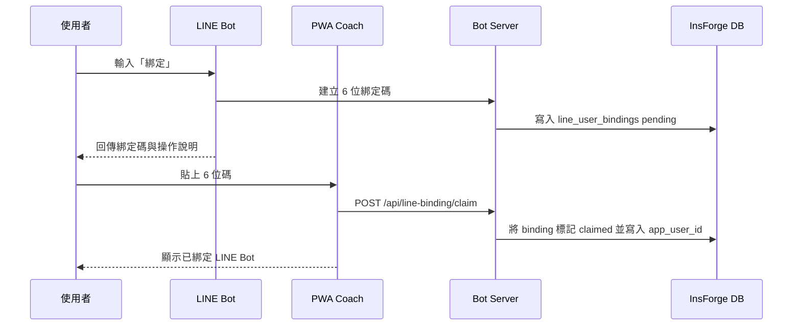
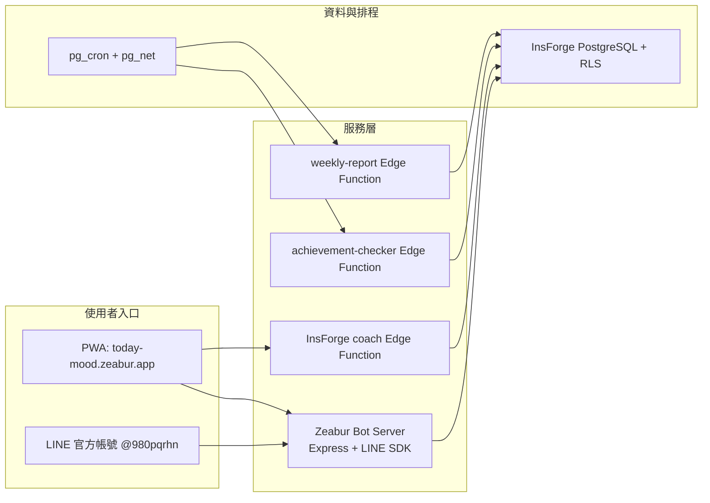
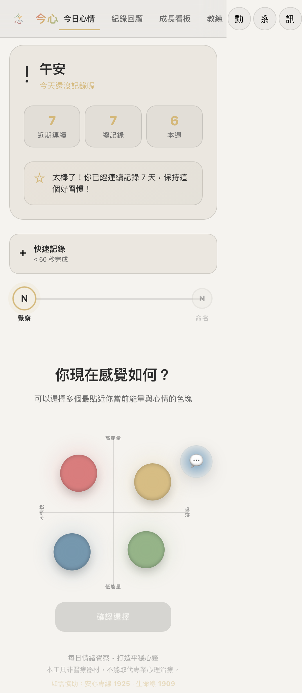
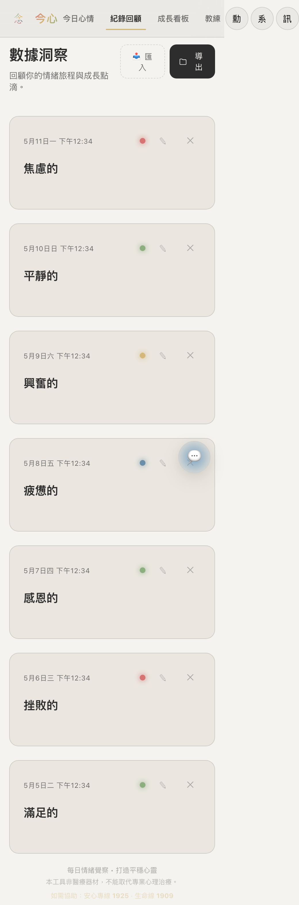
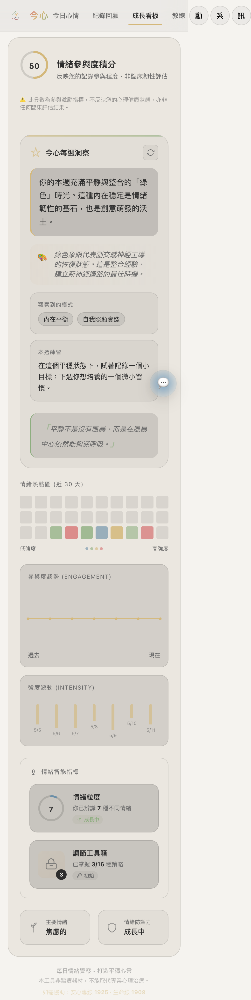
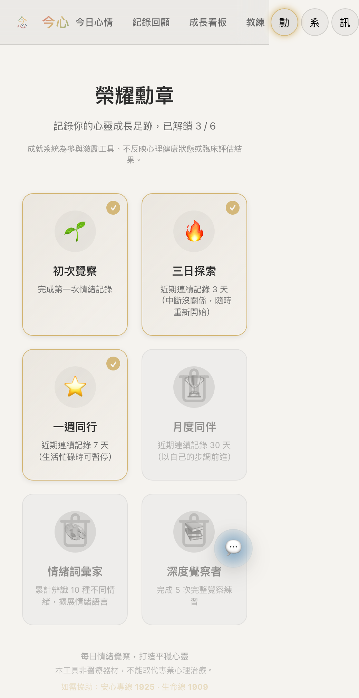
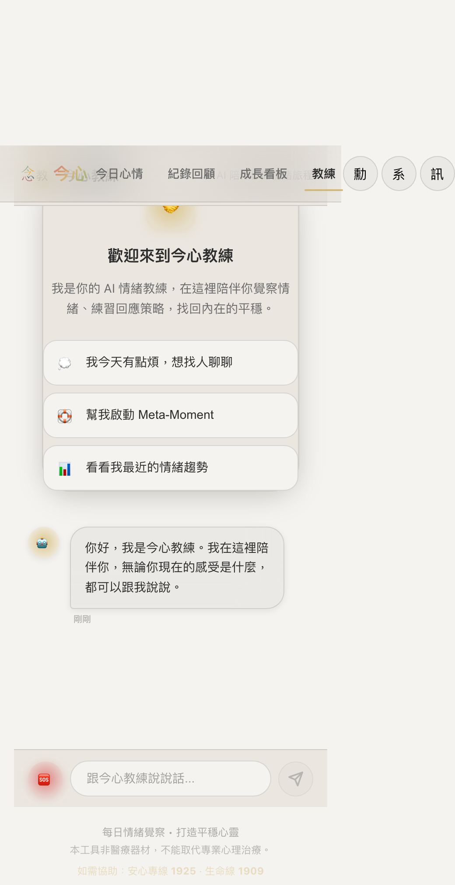

# 今心 ImXin 目前版方案規格書

**版本日期**：2026-05-14  
**對應版本**：`0542992 docs: 記錄 LINE 情緒資料流與排程驗收`
**產品狀態**：可進入小圈朋友試玩；暫不建議大量公開投放  
**線上網址**：https://today-mood.zeabur.app/#home  
**LINE 官方帳號**：鋅鋰師拔麻的小小額葉養成手札（`@980pqrhn`）  
**倉庫**：https://github.com/samulee003/EQ-monitor  

---

## 1. 一句話定位

今心是一個以「知心四式」為核心的開源情緒陪伴工具，讓使用者可以在 LINE 裡完成日常情緒覺察，也可以在 PWA 裡回顧情緒脈絡、查看成長資料，並和主動 AI 教練一起整理下一步。

今心的方法靈感明確來自 RULER 的情緒覺察技能，也參考 ACT 的心理彈性、接納與價值行動、IFS-informed 的內在部分覺察，以及 Dan Siegel-informed 的 mindsight、身心腦關係整合與可承受範圍觀點。產品前台不直接複製 RULER 的品牌化五字母流程，而是改寫為今心自己的使用者語言「知心四式」：心照、喚名、安神、動念。語氣可以帶一點武俠招式感，但不誇張、不神秘化。

今心不是心理治療、不是診斷工具，也不是單純聊天機器人；也不是 Yale、RULER Approach、ACT、IFS、Dan Siegel / Mindsight Institute 相關機構的官方產品。它的定位是「情緒覺察與調節練習工具」：在情緒高漲或混亂時，先幫使用者停一下、把感受說清楚，再選一個比較不傷害自己與他人的下一步。

---

## 2. 目前發布判斷

### 2.1 PM 結論

目前技術 blocker 已清，可以發給少量朋友試玩。適合的發布方式是「小圈朋友內測」或「Facebook 朋友協助試玩」，不建議用正式產品、療癒服務或大量開放的語氣宣傳。

### 2.2 已確認可用

- PWA 前端已部署到 Zeabur：`https://today-mood.zeabur.app/`
- Bot Server 已部署到 Zeabur：`https://imxin-bot.zeabur.app`
- InsForge Edge Functions 已部署：`coach`、`weekly-report`、`achievement-checker`
- LINE 官方帳號入口已顯示在首頁與 Coach 綁定區
- 真 LINE 綁定流程已驗：LINE 取碼、PWA Coach 貼碼、畫面顯示已綁定
- production LINE 情緒資料流已驗：有效簽名 webhook、完整知心四式、寫入 `agent_ruler_logs`、週報與 Coach 讀到資料
- 主動推送排程已啟用：`weekly-report-batch` 與 `care-scan-daily`

### 2.3 仍需注意

- 若要擴大公開，仍要找非開發者用手機跑一次完整體驗，確認一般朋友看得懂「加 LINE 官方帳號 → 輸入綁定 → 回 PWA 貼碼」。
- LINE Push 免費額度有限，主動推送需持續觀察 `notification_log` 與 LINE quota。
- AI 教練是陪伴與整理工具，不應暗示可替代真人支持、醫療或心理治療。

---

## 3. 目標使用者與核心情境

### 3.1 主要使用者

- 情緒容易累積、需要一個低壓入口整理感受的成人。
- 焦慮、育兒壓力或日常關係壓力較高的父母。
- 不想開正式 App，但願意在 LINE 裡留一句話、做短練習的人。
- 想看見自己最近情緒模式，但不想手動整理紀錄的人。

### 3.2 核心使用情境

- 使用者在 LINE 裡輸入「我今天很焦慮」，Bot 逐步帶他走完知心四式。
- 使用者在 PWA 首頁直接用四色狀態入口記錄今日心情。
- 使用者打開 Coach 問「我最近怎麼樣」，AI 教練讀取近期紀錄，整理模式與一個下一步。
- 使用者情緒很高時點 SOS，進入 緊急安定練習 暫停、呼吸與安全確認。
- 系統在固定排程產生週報或主動關懷，提醒使用者回來照顧自己。

---

## 4. 產品入口與資訊架構

### 4.1 雙入口架構

| 入口 | 定位 | 使用者要做什麼 | 系統提供什麼 |
|---|---|---|---|
| LINE Bot | 日常主要入口 | 留一句話、完成知心四式、綁定帳號 | 對話式引導、Quick Reply、LINE 記錄同步 |
| PWA | 回顧與教練入口 | 記錄、查看歷史、看趨勢、跟 Coach 對話 | 四色狀態入口、時間軸、成長看板、成就、主動教練 |

### 4.2 PWA 主導覽

目前主導覽維持使用者指定的原版文案：

- `今日心情`
- `記錄回顧`
- `成長看板`
- `教練`

右上角使用純圖示，避免「勳／亮／訊」這類不明文字：

- 獎盃圖示：我的成就
- 主題圖示：系統／淺色／深色切換
- 鈴鐺圖示：提醒設定
- 帳號圖示：登入或註冊帳號；已登入則進個人中心

### 4.3 目前視圖

| View | URL hash | 功能 |
|---|---|---|
| 今日心情 | `#home` | 首頁、四色狀態入口、快速記錄、LINE 官方帳號入口、今日教練建議 |
| 記錄回顧 | `#history` | 情緒日誌時間軸、過往紀錄查看 |
| 成長看板 | `#growth` | 情緒趨勢、熱力圖、週報洞察 |
| 成就 | `#achievement` | 成就解鎖與練習里程碑 |
| 教練 | `#coach` | 主動 AI 教練、LINE 綁定、緊急安定練習、呼吸引導 |

---

## 5. 核心流程規格

### 5.1 PWA 今日心情流程

首頁是使用者進入今心後最直接的情緒覺察入口。畫面需要保留溫和、低壓、可快速開始的感覺。

首頁目前包含：

- Logo 與主導覽。
- 快速記錄卡。
- 四色狀態選擇。
- 知心四式流程入口。
- 今日教練建議，提示使用者可以找主動教練整理卡住的感覺。
- LINE Bot 說明卡，清楚顯示官方帳號名稱、Basic ID 與加好友連結。

LINE Bot 說明文字必須讓一般使用者看得懂：

1. 先加入 LINE 官方帳號。
2. 對官方帳號輸入「綁定」。
3. 取得 6 位碼。
4. 回到 PWA 的教練頁貼上。
5. 之後 LINE 完成的覺察會同步給 AI 教練參考。

### 5.2 知心四式情緒覺察流程

知心四式是目前產品前台使用的方法語言，完整流程包含：

| 步驟 | 中文定位 | 使用者輸入 | 系統目的 |
|---|---|---|---|
| 心照式 | 身體與狀態色彩 | 身體線索、此刻狀態 | 心照一念，先知道情緒正在發生 |
| 喚名式 | 情緒詞與強度 | 具體情緒、強度分數 | 喚其真名，用更準確的詞命名感受 |
| 安神式 | 情境、需求與表達 | 觸發事件、人事物、需求、不必修飾的文字 | 安住心神，讓情緒背後的原因與需要有出口 |
| 動念式 | 呼吸、接地、正念等策略 | 一個可做的小行動 | 一念可轉，從反應切回可選擇的回應 |

PWA 版本支援完整流程與較快的記錄模式。LINE Bot 版本以對話式狀態機帶使用者逐步走完流程。

### 5.3 LINE Bot 流程

LINE Bot 是 Bot-First 架構的主要日常入口。使用者不需要先理解 App 架構，只要在 LINE 裡輸入一句話。

目前支援：

- 輸入「綁定」或 `bind` 產生 6 位綁定碼。
- 6 位綁定碼 10 分鐘內有效。
- 綁定後，LINE 完成的情緒整理會寫入可供 Coach 與週報讀取的紀錄表。
- 透過 Quick Reply 引導身體部位、情緒詞、需求、調節技巧。
- 完成後產生摘要，並可形成後續週報與教練脈絡。

LINE 官方帳號資訊：

- 名稱：鋅鋰師拔麻的小小額葉養成手札
- Basic ID：`@980pqrhn`
- 加好友連結：https://line.me/R/ti/p/@980pqrhn

### 5.4 LINE 綁定流程

綁定流程的目標，是把 LINE 使用者與 PWA 的 app user 連起來，讓 LINE 裡的情緒紀錄可以被 PWA Coach、週報與成長資料讀到。



### 5.5 AI 主動教練流程

Coach 頁不是普通聊天框，而是「主動 AI 情緒教練畫布」。它會依據：

- 使用者當下輸入。
- PWA 情緒紀錄。
- LINE 互動與綁定後的 LINE 情緒紀錄。
- 最近狀態色彩、強度、需求與週期。

目前 Coach 首屏包含：

- 主動 AI 情緒教練說明。
- 三個教練能力卡：主動提下一步、串起 LINE 與 App、看懂模式。
- 情境入口：晚上焦慮、親子修復、想看教練觀察。
- LINE Bot 綁定區。
- SOS 與呼吸引導。

Coach API 合約：

```json
{
  "message": "我今天很焦慮，強度 7 分",
  "userId": "user_local_001 或 auth user uuid",
  "sessionId": "coach-session-id"
}
```

回應格式：

```json
{
  "response": "我先陪你把焦慮放慢一點...",
  "skillInvoked": "emergency_stabilization",
  "action": "open_sos",
  "actionReason": "偵測到你可能需要緊急情緒調節協助"
}
```

### 5.6 緊急安定練習 SOS

當使用者輸入高風險或高度失控語句，或主動點 SOS，系統進入 緊急安定練習 流程。

緊急安定練習 四步：

1. 感知：注意身體與當下狀態。
2. 暫停：呼吸、降速、把注意力帶回現在。
3. 看見最好的自己：提醒使用者想成為怎樣的人。
4. 策略行動：選擇呼吸、接地、找人、離開現場等下一步。

安全邊界：

- 不做診斷。
- 不把 AI 回覆包裝成醫療建議。
- 危機語句要優先支持安全與真人連結。
- 前端可觸發 `open_sos`、`start_breathing` 等具體動作。

---

## 6. 功能模組規格

### 6.1 今日心情

使用者價值：

- 打開就能知道「我現在可以做什麼」。
- 不需要先登入。
- 可以用四色狀態入口或快速記錄開始。
- 可以知道 LINE Bot 要加哪個帳號、怎麼綁定。

規格要點：

- 頁面標題與導覽不可再改成「安定室」。
- LINE 官方帳號資訊必須可見。
- 「今日教練建議」需用一般人懂的語言，不堆疊 Agentic AI 術語。

### 6.2 記錄回顧

使用者價值：

- 回看過去的情緒紀錄，而不是只停在當下。
- 看見自己常出現的情緒、強度與需求。

規格要點：

- 以時間軸呈現紀錄。
- 空狀態需引導回「今日心情」開始第一筆紀錄。
- 若有隱私鎖，進入敏感內容前需驗證。

### 6.3 成長看板

使用者價值：

- 把零散情緒變成可理解的趨勢。
- 看到週期、狀態色彩分布、強度變化。

規格要點：

- 以四色狀態與低飽和色彩呈現。
- 週報由 Edge Function 讀取 `ruler_logs` 或 `agent_ruler_logs` 後生成。
- 沒資料時要鼓勵使用者先完成一筆覺察，不製造挫敗感。

### 6.4 成就

使用者價值：

- 把練習變成可以被看見的小進步。
- 鼓勵連續記錄、情緒詞彙擴展、完整流程完成。

規格要點：

- Header 使用獎盃圖示，不使用「勳」字按鈕。
- `achievement-checker` 可根據紀錄與 streak 解鎖成就。
- 成就語氣要像溫柔提醒，不像遊戲化壓迫。

### 6.5 教練

使用者價值：

- 使用者不需要自己想下一步。
- 可以直接說「我現在很焦慮」，教練協助拆解。
- 可以讀到 PWA 與 LINE 累積的脈絡。

規格要點：

- Coach 首屏明確說明「主動教練」。
- LINE 綁定區必須包含官方帳號、Basic ID、加好友連結與 6 位碼輸入。
- Coach 的工具能力包含查摘要、查趨勢、存情緒紀錄、觸發前端行動。
- `coach-simple.ts` 是 production 入口，因 InsForge 打包限制需保持自包含 prompt builder。

---

## 7. 系統架構

### 7.1 總覽



### 7.2 前端 PWA

| 項目 | 規格 |
|---|---|
| 框架 | React 19 + TypeScript strict mode |
| 建置 | Vite 7 |
| PWA | vite-plugin-pwa + Workbox |
| 移動端 | Capacitor 7 Android |
| 狀態 | Zustand + React Context + useReducer |
| 樣式 | Vanilla CSS / CSS Modules / Morandi UI |
| 語言 | 繁體中文為主，opencc-js 支援轉換 |

### 7.3 Bot Server

| 項目 | 規格 |
|---|---|
| Runtime | Node.js 18+ |
| 框架 | Express 5 + TypeScript |
| LINE | @line/bot-sdk 9.x |
| 資料層 | memory adapter（dev/test）與 InsForge PostgreSQL adapter（production） |
| 安全 | `/webhook` 使用 raw body + `x-line-signature` 驗簽 |

主要端點：

| 端點 | 用途 |
|---|---|
| `GET /health` | Bot Server 健康檢查 |
| `POST /webhook` | LINE webhook |
| `POST /api/line-binding/claim` | PWA 認領 LINE 綁定碼 |
| `GET /api/dashboard/:lineUserId/summary` | LINE 使用者摘要 |
| `GET /api/dashboard/:lineUserId/weekly-report` | LINE 使用者週報 |

### 7.4 InsForge Edge Functions

| Function | 用途 | 狀態 |
|---|---|---|
| `coach` | AI 主動教練、工具調用、緊急安定練習、紀錄保存 | 已部署 |
| `weekly-report` | 讀取情緒紀錄產生週報 | 已部署 |
| `achievement-checker` | 檢查成就與主動關懷掃描 | 已部署 |

### 7.5 主動推送排程

| Job | UTC | 台北時間 | 目標 |
|---|---|---|---|
| `weekly-report-batch` | `0 13 * * 0` | 每週日 21:00 | 週報批次 |
| `care-scan-daily` | `0 2 * * *` | 每日 10:00 | 主動關懷掃描 |

Production DB 已啟用 `pg_cron` 與 `pg_net`。GitHub Actions fallback 保留，避免平台排程異常時完全失效。

---

## 8. 資料模型與隱私

### 8.1 本地資料

| Key | 用途 |
|---|---|
| `feelings_logs` | 本機情緒記錄 |
| `ruler_draft` | 未完成流程草稿 |
| `user_progress` | 成就與進度 |
| `jinxin-language` | 語言偏好 |
| `imxin-theme` | 主題偏好 |
| `imxin_privacy_pin` | 隱私 PIN hash |

敏感資料需經 `dataAdapter` 操作，不直接碰 `localStorage`。

### 8.2 InsForge 資料表

| 表 | 用途 | 存取策略 |
|---|---|---|
| `profiles` | 使用者資料 | 使用者只能讀寫自己 |
| `ruler_logs` | Auth 使用者完整情緒紀錄 | RLS own records |
| `ruler_drafts` | 雲端草稿 | RLS own records |
| `achievement_records` | 成就解鎖 | RLS own records |
| `streaks` | 連續紀錄 | 使用者讀、service role 更新 |
| `coach_context` | 教練元資料、近期狀態色彩、需求、強度 | 使用者 own + service role |
| `coach_messages` | 教練對話歷史 | 使用者 own + service role |
| `line_user_bindings` | LINE 與 PWA 綁定碼 | service role only |
| `agent_ruler_logs` | LINE / Coach / PWA 內測橋接紀錄 | service role only |
| `notification_log` | 主動推送冪等紀錄 | service role only |

### 8.3 情緒日誌核心欄位

```typescript
type RulerLogEntry = {
  id: string;
  emotions: Emotion[];
  intensity: number;
  bodyScan: { location: string; sensation: string } | null;
  understanding: UnderstandingData | null;
  expressing: ExpressingData | null;
  regulating: RegulatingData | null;
  physicalContext?: { sleepHours: number; activityLevel: number };
  postMood: string;
  timestamp: string;
  isFullFlow?: boolean;
};
```

### 8.4 隱私原則

- 預設本地優先。
- 使用者可不登入也能使用核心情緒覺察。
- 帳號登入用於跨裝置、雲端紀錄、Coach 記憶與 LINE 綁定。
- LINE binding 與 agent bridge 使用 service role 存取，不暴露給一般前端查詢。
- 測試資料需在 smoke 後清理，不保留真實 LINE user id 或密鑰在文件中。

---

## 9. AI 教練規格

### 9.1 教練人格

AI 教練應像「溫柔、清楚、可行動的情緒整理者」，不是高高在上的分析師。

語氣原則：

- 繁體中文。
- 短句，先接住，再整理。
- 不急著給大道理。
- 不假裝知道使用者沒說的事。
- 每次盡量給一個可完成的小下一步。

### 9.2 工具能力

| Tool | 用途 |
|---|---|
| `get_user_emotion_summary` | 讀取近期情緒摘要與 streak |
| `get_emotion_trend` | 分析近 7 天或指定天數趨勢 |
| `save_ruler_log` | 把明確紀錄請求保存為情緒日誌 |
| `trigger_action` | 觸發前端動作：呼吸、記錄、SOS、歷史、成長 |

### 9.3 決定性保存規則

當使用者明確要求「幫我記錄」且訊息內包含情緒與 1-10 強度時，production `coach` 會先做 deterministic save，再讓 AI 回覆。這可以避免 AI 說「我幫你記下了」但資料庫沒有落庫。

### 9.4 Prompt 與 production 限制

`server/insforge/agents/soul.md` 是教練人格規格；`server/src/agents/soulInstruction.ts` 是 canonical builder；但 InsForge Functions 打包曾無法解析本地 shared module import，因此 production `server/insforge/functions/coach-simple.ts` 必須保持自包含版本。

更新 Coach prompt 時必須同步檢查：

- `server/insforge/agents/soul.md`
- `server/src/agents/soulInstruction.ts`
- `server/insforge/functions/coach-simple.ts`
- `server/insforge/agents/soulContract.test.ts`

---

## 10. 設計系統

### 10.1 視覺方向

今心使用 Luminous Morandi：低飽和、柔和、有呼吸感，避免醫療感、命令感或過度遊戲化。

| 狀態色彩 | 色碼 | 情緒 |
|---|---|---|
| 紅色 | `#C58B8A` | 很滿、卡住，例如焦慮、憤怒 |
| 黃色 | `#D5C1A5` | 很滿、順心，例如興奮、期待 |
| 藍色 | `#97A6B4` | 很慢、卡住，例如疲憊、沮喪 |
| 綠色 | `#AAB09B` | 很慢、順心，例如平靜、滿足 |

### 10.2 文案方向

文案要保留原本「今日心情」這種直接可懂的命名。若需要介紹 Agentic AI，前台用語應改寫為：

- 主動教練
- 陪你整理下一步
- 看見最近的情緒線索
- 把 LINE 和 App 的紀錄串起來

避免使用：

- 安定室
- 洞察
- 主動教練作為主導覽文字
- 不明單字按鈕，例如「勳」「亮」「訊」

### 10.3 畫面截圖

目前已有舊版方案截圖資產，可作為更新簡報或 HTML 規格時的基礎：

- 
- 
- 
- 
- 

---

## 11. 驗證狀態

### 11.1 本機基線

最近文件記錄的基線：

- 前端全量：`npm run test:run` 通過，366 tests / 39 files
- 前端 build：`npm run build` 通過
- TypeScript：`npx tsc --noEmit` 通過
- lint：0 errors / 31 warnings
- 後端：`cd server && npm run test:run` 通過，156 tests / 15 files
- 後端 build：`cd server && npm run build` 通過

### 11.2 Production smoke

已驗證：

- Bot `/health` 回 `adapter: insforge`
- PWA endpoint HTTP 200
- Zeabur PWA latest deployment 為 `RUNNING`
- `/webhook` 缺簽名或錯簽名會 401
- production `/webhook` 使用有效 LINE 簽名可接受完整知心四式訊息
- `agent_ruler_logs` 寫入 LINE full-flow 資料
- `weekly-report` 可讀取 LINE 情緒資料
- Coach 可讀到最近一筆 LINE 情緒資料
- 測試 binding、bot user、session、message、agent log、ADK session/event 已清理
- `pg_cron` / `pg_net` 已安裝，兩個 production cron job active

### 11.3 E2E 覆蓋

目前 Playwright 關鍵路徑包含：

- 今心首頁進入與四色狀態選擇。
- Coach SOS 開啟 緊急安定練習 四步覆蓋層。
- LINE 綁定碼輸入後顯示已綁定。

---

## 12. 發布與營運方案

### 12.1 今晚朋友試玩建議

發布語氣應該是「早期試玩、幫忙抓卡點」，不是正式產品上市。

建議朋友試玩任務：

1. 打開 PWA。
2. 看首頁是否知道可以做什麼。
3. 加入 LINE 官方帳號。
4. 對 LINE 輸入「綁定」。
5. 回 PWA 教練頁貼碼。
6. 在 LINE 完成一次簡短知心四式。
7. 回 PWA Coach 問「我剛剛記了什麼」或「我最近怎麼樣」。
8. 回報哪一步看不懂、卡住或不安心。

### 12.2 建議 Facebook 文字

```text
我做了一個情緒覺察小工具「今心」，想找幾位朋友試玩。

它可以用 APP 記錄今天心情，也可以加入 LINE Bot 做一段簡短覺察；AI 教練會幫你把最近的情緒線索整理成一個下一步。

這是早期測試版，如果你願意幫我試一下，任何卡住或看不懂的地方都跟我說：
https://today-mood.zeabur.app/#home

LINE 官方帳號：鋅鋰師拔麻的小小額葉養成手札
Basic ID：@980pqrhn
```

---

## 13. 非目標

目前不做：

- 付費訂閱正式上線。
- 大量公開宣傳。
- 醫療診斷或心理治療宣稱。
- 未經同意的主動推送。
- 把真實 LINE user id、密鑰或 production 測試身分寫入文件。
- 為了測試方便降低 webhook 驗簽或 RLS 安全。

---

## 14. 下一階段建議

### P0：發布前最後人工驗收

- 找 1 位朋友用手機完整跑：PWA → LINE 加好友 → 輸入綁定 → PWA 貼碼 → LINE 情緒整理 → Coach 讀資料。
- 記錄朋友在哪一句文案、哪個按鈕或哪個畫面卡住。

### P1：體驗修正

- 若朋友仍不懂 LINE 綁定，首頁與 Coach 加一段更短的三步驟圖解。
- 若 Coach 看起來像普通聊天，把「我可以主動幫你整理下一步」放到更靠前。
- 若使用者不知道從 LINE 還是 PWA 開始，首頁第一屏用一句話分流。

### P2：產品化

- 正式隱私政策與免責聲明。
- LINE Push quota 監控。
- 主動推送 opt-in 設定頁。
- 更完整的 Playwright 手機 viewport E2E。
- 更新舊版 HTML 方案規格，重新截圖當前 UI。

---

## 15. Agent 交接備註

後續 agent 接手前應先讀：

- `AGENTS.md`
- `CHANGELOG.md`
- `memory.md`
- 本文件

若要改 AI 教練，優先檢查 `soul.md`、`soulInstruction.ts`、`coach-simple.ts` 與 `soulContract.test.ts` 是否同步。

若要改 LINE 綁定或 Bot 流程，優先檢查：

- `src/constants/lineBot.ts`
- `src/components/CheckInFlow.tsx`
- `src/pages/CoachPage.tsx`
- `src/services/BotSyncService.ts`
- `server/src/rulerBot.ts`
- `server/src/api/dashboard.ts`
- `server/src/db/insforgeAdapter.ts`
- `server/insforge/schema/008_agentic_coach_bridge.sql`

完成任何發布相關變更後，至少驗證：

- Header nav 是否仍是 `今日心情 / 記錄回顧 / 成長看板 / 教練`
- 右上角是否仍是純圖示
- 首頁與 Coach 是否仍顯示 LINE 官方帳號 `@980pqrhn`
- Coach 是否仍能觸發 `open_sos`
- LINE binding claim 是否仍回成功
- production smoke 資料是否已清理
