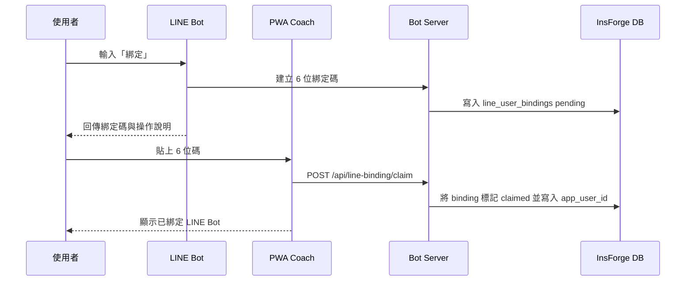
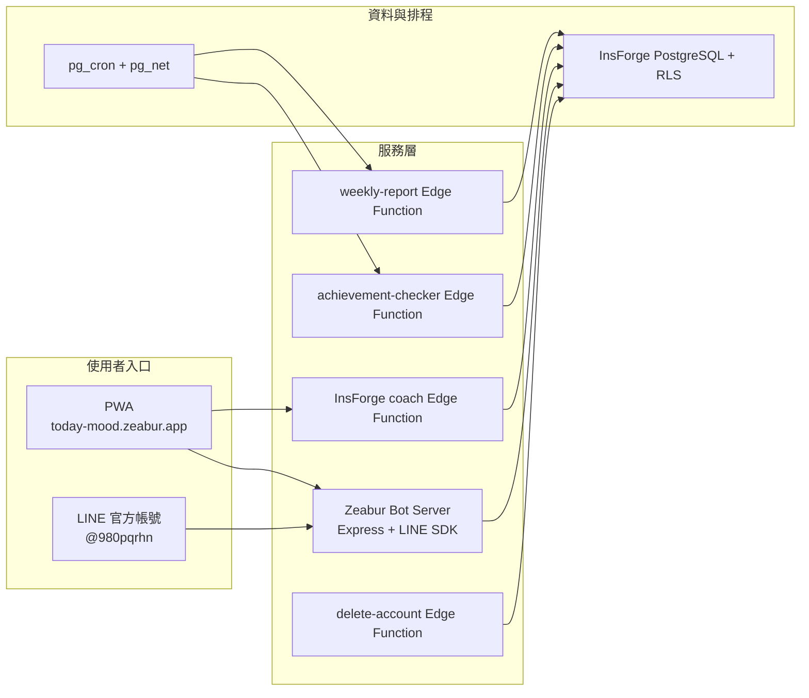

# 今心 ImXin 目前版 APP 方案規格書

- **版本日期**：2026-05-15
- **文件狀態**：依 2026-05-15 方法語言風險收斂後重寫
- **對應主線**：`4233220 docs: 更新 agent 交接文件`
- **產品版本**：V1.0.0 起點版，進入小圈朋友試玩階段
- **線上 PWA**：https://today-mood.zeabur.app/
- **Bot Server**：https://imxin-bot.zeabur.app
- **LINE 官方帳號**：鋅鋰師拔麻的小小額葉養成手札（`@980pqrhn`）
- **Repository**：https://github.com/samulee003/EQ-monitor

---

## 1. 產品一句話

今心 ImXin 是一個開源情緒覺察 PWA + LINE Bot，幫焦慮父母與日常壓力較高的成人，在情緒升高時先停一下、看清楚感受，再選一個較不傷害自己與他人的下一步。

產品前台方法語言定稿為 **知心四式**：

| 順序 | 名稱 | 口號 | 使用者任務 |
|---|---|---|---|
| 第一式 | 心照 | 心照一念，先看清此刻。 | 注意身體、能量、愉悅度與當下狀態。 |
| 第二式 | 喚名 | 喚其真名，精準靠近感受。 | 選出更準確的情緒詞與強度。 |
| 第三式 | 安神 | 安住心神，讓感受與需要有地方放。 | 看見情境、需求、內在部分與想說的話。 |
| 第四式 | 動念 | 一念可轉，選一個可做的小行動。 | 選擇呼吸、接地、修復、離開現場或求助等下一步。 |

今心的體驗可以有一點武俠心法感，但不神秘化、不誇張，也不把情緒練習包裝成治療。

---

## 2. 方法來源與產品邊界

### 2.1 靈感來源

今心的方法設計要誠實說明來源：

- **RULER-inspired**：重視情緒辨識、理解、命名、表達與調節能力。
- **ACT-informed**：重視接納、心理彈性、價值方向與可實踐的小行動。
- **IFS-informed**：允許使用者看見不同內在部分、需求與保護策略。
- **Dan Siegel-informed**：參考 mindsight、身心腦整合、可承受範圍與整合性覺察。

### 2.2 不宣稱的事

今心不得宣稱：

- 是 Yale、RULER Approach、How We Feel、ACT、IFS、Dan Siegel / Mindsight Institute 或任何治療機構的官方產品。
- 提供心理治療、醫療診斷、危機處置或專業諮商。
- 阿念教練可以替代真人支持、醫師、心理師或緊急服務。

### 2.3 命名避險原則

- 前台與 active prompt 使用「知心四式：心照、喚名、安神、動念」。
- 四象限 / energy-valence 型情緒地圖可保留，這是常見情緒教育視覺方式，不作為 RULER 專屬命名。
- 不使用 `Mood Meter`、`Meta-Moment`、`How We Feel` 作為前台產品語言、流程名稱或 active prompt。
- 內部相容 identifier 可以暫留，例如 `ruler_logs`、`RulerLogEntry`、`useRulerFlow`、`server/src/rulerBot.ts`，避免已部署資料與 migration 失配。

---

## 3. 目前 PM 判斷

### 3.1 發布狀態

目前產品適合 **1-3 位熟人封閉試玩**。技術主鏈路已能支撐試玩，但還不建議用正式心理健康服務、療癒服務或大規模公開宣傳語氣推出。

### 3.2 已可試玩的核心鏈路

- 使用者打開 PWA，從「今日心情」開始記錄。
- 使用者加入 LINE 官方帳號，輸入「綁定」取得 6 位碼。
- 使用者回到 PWA 教練頁貼碼，完成 LINE 與 PWA account 綁定。
- 使用者在 LINE 完成一次知心四式。
- LINE 紀錄寫入 `agent_ruler_logs`，週報與 Coach 可讀到同一筆資料。
- 使用者在 Coach 問「我最近怎麼樣」，阿念教練可依近期紀錄整理模式與下一步。

### 3.3 尚未完成或需注意

- 方法語言更名後尚未重新部署 production；下一次部署前需要跑 PWA + LINE Bot smoke。
- 非開發者手機試玩仍是下一個最重要驗收，不應只看測試綠燈。
- LINE Push quota、主動推送 opt-in 設定頁、正式法律式隱私與免責審稿仍屬 P2。

---

## 4. 目標使用者與使用場景

### 4.1 主要使用者

- 焦慮、育兒壓力或家庭互動壓力較高的父母。
- 容易情緒累積，但不想打開複雜心理健康 App 的成人。
- 願意在 LINE 裡丟一句話、完成一段短練習的人。
- 想看見自己最近情緒模式，但不想手動整理紀錄的人。

### 4.2 典型情境

| 情境 | 使用者狀態 | 今心回應 |
|---|---|---|
| 睡前焦慮 | 腦中一直轉，身體緊繃 | LINE 或 PWA 帶他完成心照、喚名、安神、動念。 |
| 親子衝突後 | 後悔、內疚、想修復 | Coach 先接住情緒，再幫他選一個修復小行動。 |
| 白天快爆炸 | 怒氣、壓力、想衝出口 | SOS 進入緊急安定練習，先降速再決定下一步。 |
| 想看近期模式 | 不確定自己最近怎麼了 | Coach 串起 PWA 與 LINE 紀錄，整理高頻情緒、需求與提醒。 |

---

## 5. 產品入口與資訊架構

### 5.1 雙入口策略

| 入口 | 定位 | 適合場景 | 主要能力 |
|---|---|---|---|
| PWA | 共同入口與回顧中心 | 任何朋友都能直接打開，不需先裝 LINE | 今日心情、記錄回顧、成長看板、Coach、帳號與綁定 |
| LINE Bot | 日常對話入口 | 使用者只想丟一句話、在熟悉聊天介面完成練習 | 綁定碼、知心四式對話、Quick Reply、同步紀錄 |

WeChat 使用者在 V1.0 先走 PWA，不做 WeChat Bot。WeChat Official Account / Bot 放到 P2 或更後。

### 5.2 PWA 主導覽

主導覽維持簡單可懂，不把內部概念放在第一層：

- `今日心情`
- `記錄回顧`
- `成長看板`
- `教練`

右上角維持純 SVG 圖示：

- 成就
- 主題
- 提醒
- 帳號

### 5.3 PWA 視圖

| View | URL hash | 功能定位 |
|---|---|---|
| 今日心情 | `#home` | 四象限狀態入口、快速記錄、LINE 官方帳號入口、今日教練建議 |
| 記錄回顧 | `#history` | 情緒日誌時間軸與過往紀錄 |
| 成長看板 | `#growth` | 情緒趨勢、熱力圖、週報洞察 |
| 成就 | `#achievement` | 練習里程碑、連續記錄與鼓勵 |
| 教練 | `#coach` | 阿念教練、LINE 綁定、SOS、呼吸引導 |
| 關於我們 | `#about` | App 內產品說明，從頁尾產品資訊進入 |

使用者打開無 hash 的根網址時，應直接進入 `#home` 的今日心情入口；初次使用者看完動畫後仍會看到 App onboarding，已完成 onboarding 的使用者則直接露出四色選擇。產品說明不作為預設入口，改放在 `#about`「關於我們」。舊 `#landing` 僅保留為相容轉址，應轉到 `#about`。

---

## 6. 核心功能規格

### 6.1 今日心情

使用者打開首頁後，應該能立刻知道「我現在可以做什麼」。首頁不是說明書，也不是行銷頁，而是實際使用入口。

必要內容：

- 四象限狀態選擇。
- 快速情緒記錄。
- 知心四式入口。
- 今日教練建議。
- LINE 官方帳號入口與 Basic ID。
- 對未登入使用者保持可用，不用先要求註冊。

驗收：

- 首屏不用內部術語解釋「agentic」。
- 不出現 `Mood Meter`、`How We Feel` 或 `Meta-Moment` 等前台命名。
- LINE 官方帳號名稱與 `@980pqrhn` 容易看到。

### 6.2 知心四式

知心四式是 PWA 與 LINE 共用的前台方法語言。

| 步驟 | 使用者輸入 | 系統引導 | 設計重點 |
|---|---|---|---|
| 心照 | 身體部位、身體感覺、能量、愉悅度 | 先看見狀態，不急著分析 | 允許使用者只用很短的描述開始。 |
| 喚名 | 情緒詞、強度 1-10 | 幫感受找到比較準確的名字 | 情緒詞可以細緻，但不能像考試。 |
| 安神 | 情境、需求、想說的話、內在部分 | 把原因與需要放到安全位置 | 可以使用 IFS-informed 的「有一部分的我」。 |
| 動念 | 一個小行動、調節方式、求助或修復 | 從反應回到選擇 | 行動要小到今天可做，不講大道理。 |

文案準則：

- 可以寫「第一式：心照」，但步驟名稱本身是「心照」。
- 口號保留武俠心法感，但要清楚、溫柔、可執行。
- 不把四步寫成神奇療法或正式治療技術。

### 6.3 LINE Bot

LINE Bot 是日常低阻力入口。使用者不需要先理解完整 App，只要在 LINE 裡丟一句話或輸入「綁定」。

目前支援：

- 輸入「綁定」或 `bind` 產生 6 位碼。
- 綁定碼 10 分鐘內有效。
- 使用 Quick Reply 引導身體、情緒、需求與下一步。
- 完成知心四式後寫入可被 Coach / 週報讀取的紀錄。
- `/webhook` 使用 LINE signature 驗證，缺簽或錯簽回 401。

LINE 官方帳號資訊：

- 名稱：鋅鋰師拔麻的小小額葉養成手札
- Basic ID：`@980pqrhn`
- 加好友連結：https://line.me/R/ti/p/@980pqrhn

### 6.4 LINE 綁定

目標：把 LINE 使用者與 PWA app user 連起來，讓 LINE 裡完成的情緒整理可以被 PWA Coach、週報與成長看板使用。



驗收：

- 使用者可從 LINE 取得 6 位碼。
- PWA Coach 可提交 6 位碼並顯示已綁定。
- 綁定成功後的 LINE 情緒紀錄能被 Coach 讀到。

### 6.5 阿念教練

Coach 不是普通聊天框，而是阿念教練的對話畫布。阿念應該能讀近期脈絡、看見模式、慢慢懂使用者的節奏，並提出一個可以做的下一步。

Coach 使用資料：

- PWA 情緒紀錄。
- LINE 綁定後的情緒紀錄。
- `coach_context` 中的近期狀態、需求、強度與 streak。
- 使用者當下輸入。

Coach 首屏應包含：

- 阿念教練的普通人語言說明。
- 可直接點選的情境入口，例如晚上焦慮、親子修復、想看阿念觀察。
- LINE 綁定區。
- SOS / 呼吸引導入口。

AI 回覆原則：

- 先接住，再整理，再給一步。
- 使用繁體中文。
- 不急著診斷、不套公式。
- 不假裝讀到不存在的資料。
- 危機語句優先安全與真人支持。

### 6.6 緊急安定練習

當使用者輸入高風險、高失控或高度痛苦語句，Coach 可以回傳公開 enum `emergency_stabilization` 並觸發 `open_sos`。

緊急安定練習目標：

- 先降低生理與注意力負荷。
- 引導使用者回到當下環境。
- 鼓勵安全、求助與延後衝動行動。
- 不提供醫療診斷或危機處置承諾。

---

## 7. 系統架構

### 7.1 架構總覽



### 7.2 前端 PWA

| 項目 | 規格 |
|---|---|
| Framework | React 19 + TypeScript strict mode |
| Build | Vite 7 |
| PWA | vite-plugin-pwa + Workbox |
| Mobile | Capacitor 7 Android |
| State | Zustand + React Context + useReducer |
| Style | Vanilla CSS / CSS Modules / Luminous Morandi UI |
| Language | 繁體中文為主，opencc-js 支援轉換 |

### 7.3 Bot Server

| 項目 | 規格 |
|---|---|
| Runtime | Node.js 18+ |
| Framework | Express 5 + TypeScript |
| LINE SDK | `@line/bot-sdk` 9.x |
| Data adapter | memory adapter for dev/test, InsForge PostgreSQL adapter for production |
| Security | raw body + `x-line-signature` 驗簽 |

主要端點：

| Endpoint | 用途 |
|---|---|
| `GET /health` | Bot Server 健康檢查 |
| `POST /webhook` | LINE webhook |
| `POST /api/line-binding/claim` | PWA 認領 LINE 綁定碼 |
| `GET /api/dashboard/:lineUserId/summary` | LINE 使用者摘要 |
| `GET /api/dashboard/:lineUserId/weekly-report` | LINE 使用者週報 |

### 7.4 InsForge Edge Functions

| Function | 用途 | 狀態 |
|---|---|---|
| `coach` | 阿念教練、工具調用、緊急安定練習、紀錄保存 | 已部署 / 已驗 |
| `weekly-report` | 讀取情緒紀錄產生週報 | 已部署 / 已驗 |
| `achievement-checker` | 成就檢查與主動關懷掃描 | 已部署 / 已驗 |
| `delete-account` | 帳號刪除與 tombstone | 已部署 / 已驗 |

### 7.5 主動推送排程

Production DB 已啟用 `pg_cron` 與 `pg_net`。

| Job | UTC | 台北時間 | 用途 |
|---|---|---|---|
| `weekly-report-batch` | `0 13 * * 0` | 每週日 21:00 | 批次產生週報 |
| `care-scan-daily` | `0 2 * * *` | 每日 10:00 | 主動關懷掃描 |

推送守門：

- 需要 LINE 綁定。
- 需要 opt-in。
- 需要 `notification_log` 做冪等與紀錄。
- 不做未經同意的主動推送。

---

## 8. 資料模型與隱私

### 8.1 本地資料

| Key | 用途 |
|---|---|
| `feelings_logs` | 本機情緒紀錄 |
| `ruler_draft` | 未完成流程草稿 |
| `user_progress` | 成就與進度 |
| `jinxin-language` | 語言偏好 |
| `imxin-theme` | 主題偏好 |
| `imxin_privacy_pin` | 隱私 PIN hash |

敏感資料應經 `dataAdapter` 操作，不直接散落讀寫 `localStorage`。

### 8.2 InsForge 資料表

| 表 | 用途 | 存取策略 |
|---|---|---|
| `profiles` | 使用者資料 | 使用者 own records |
| `ruler_logs` | Auth 使用者完整情緒紀錄 | RLS own records |
| `ruler_drafts` | 雲端草稿 | RLS own records |
| `achievement_records` | 成就解鎖 | RLS own records |
| `streaks` | 連續紀錄 | user read, service role update |
| `coach_context` | 教練近期狀態、需求、強度、streak | user own + service role |
| `coach_messages` | 教練對話歷史 | user own + service role |
| `line_user_bindings` | LINE 與 PWA 綁定碼 | service role only |
| `agent_ruler_logs` | LINE / Coach / PWA 內測橋接紀錄 | service role only |
| `notification_log` | 主動推送與冪等紀錄 | service role only |
| `account_deletions` | 刪帳最小 tombstone | service role / guard |

### 8.3 情緒紀錄核心欄位

```typescript
type RulerLogEntry = {
  id: string;
  emotions: Emotion[];
  intensity: number;
  bodyScan: { location: string; sensation: string } | null;
  understanding: UnderstandingData | null;
  expressing: ExpressingData | null;
  regulating: RegulatingData | null;
  physicalContext?: { sleepHours: number; activityLevel: number };
  postMood: string;
  timestamp: string;
  isFullFlow?: boolean;
};
```

### 8.4 隱私與安全原則

- 預設本地優先；不登入也能完成核心覺察。
- 登入用於跨裝置、雲端紀錄、Coach 記憶、LINE 綁定與刪帳。
- `delete-account` 清理 app / public 資料並寫入最小刪除紀錄。
- LINE user id、API key、service role key 不寫入文件或測試輸出。
- Production smoke 後清理測試 binding、bot user、session、message、agent log 與 ADK event。

---

## 9. 阿念教練規格

### 9.1 教練人格

阿念教練像「溫柔、清楚、可行動的情緒整理者」。

它應該：

- 先接住情緒，再整理線索。
- 用短句，讓焦慮狀態下的人也讀得下去。
- 盡量每次只給一個小下一步。
- 承認不確定，不補腦。
- 在危機語句中優先安全與真人支持。

它不應該：

- 診斷使用者。
- 說自己能治療、評估疾病或處理危機。
- 用過度專業術語壓過使用者當下感受。
- 把 RULER / ACT / IFS / Dan Siegel 任何一方包裝成官方背書。

### 9.2 工具能力

| Tool | 用途 |
|---|---|
| `get_user_emotion_summary` | 讀取近期情緒摘要與 streak |
| `get_emotion_trend` | 分析近 7 天或指定天數趨勢 |
| `save_ruler_log` | 保存明確紀錄請求 |
| `trigger_action` | 觸發前端動作，例如呼吸、記錄、SOS、歷史、成長 |

### 9.3 Deterministic save

當使用者明確要求「幫我記錄」且訊息中包含情緒與 1-10 強度時，production `coach` 先 deterministic save，再讓 AI 回覆。這避免 AI 說「我幫你記下了」但資料庫沒有落庫。

### 9.4 Prompt 同步範圍

改阿念教練方法語言時，必須同步：

- `server/insforge/agents/soul.md`
- `server/src/agents/soulInstruction.ts`
- `server/insforge/functions/coach-simple.ts`
- `server/insforge/agents/soulContract.test.ts`
- 相關前端 fallback 與測試

目前 production `coach-simple.ts` 因 InsForge 打包限制，需保持自包含 prompt builder。

---

## 10. 設計與文案系統

### 10.1 視覺方向

今心使用 Luminous Morandi：低飽和、柔和、有呼吸感。視覺不走醫療冰冷感，也不走高壓遊戲化。

| 狀態色彩 | 色碼 | 情緒象限 |
|---|---|---|
| 紅色 | `#C58B8A` | 能量高、感受不舒服，例如焦慮、憤怒 |
| 黃色 | `#D5C1A5` | 能量高、感受舒服，例如期待、興奮 |
| 藍色 | `#97A6B4` | 能量低、感受不舒服，例如疲憊、低落 |
| 綠色 | `#AAB09B` | 能量低、感受舒服，例如平靜、安穩 |

### 10.2 文案方向

可使用：

- 阿念教練
- 陪你整理下一步
- 看見最近的情緒線索
- 把 LINE 和 App 的紀錄串起來
- 知心四式
- 心照、喚名、安神、動念

避免使用：

- `Mood Meter`
- `Meta-Moment`
- `How We Feel`
- 安定室作為主導航
- 不明文字按鈕，例如「勳」「亮」「訊」
- 過度技術化的 Agentic AI 說明放在首屏

---

## 11. 驗證基線

### 11.1 最新本地基線

截至 2026-05-15 最新交接文件記錄：

| 類型 | 指令 | 結果 |
|---|---|---|
| Frontend tests | `npm run test:run` | 368 tests / 40 files passed |
| Server tests | `cd server && npm run test:run` | 164 tests / 17 files passed |
| Frontend build | `npm run build` | passed |
| Server build | `cd server && npm run build` | passed |
| Frontend lint | `npm run lint` | 0 errors / 31 warnings |
| Server lint | `cd server && npm run lint` | 0 errors / 24 warnings |
| E2E | `npm run test:e2e` | 4 passed |
| Whitespace | `git diff --check` | passed |

### 11.2 Production smoke 已驗證

- PWA、LINE 綁定、LINE 情緒資料流、Coach、週報、主動排程、刪帳流程均已跑過。
- 測試資料已清理。
- 方法語言更名後尚未重新部署 production，因此下次部署前需重新 smoke。

### 11.3 關鍵 E2E

- 首頁進入與四色狀態選擇。
- Coach SOS 開啟緊急安定練習。
- LINE 綁定碼輸入後顯示已綁定。
- PWA 與 LINE 情緒資料流可被 Coach / weekly-report 使用。

---

## 12. 試玩與營運方案

### 12.1 封閉試玩任務

給 1 位非開發者朋友的試玩任務：

1. 用手機打開 PWA。
2. 看首頁是否知道下一步可以做什麼。
3. 加 LINE 官方帳號。
4. 對 LINE 輸入「綁定」。
5. 回 PWA 教練頁貼上 6 位碼。
6. 在 LINE 完成一次知心四式。
7. 回 Coach 問「我剛剛記了什麼」或「我最近怎麼樣」。
8. 回報哪一步看不懂、卡住或不安心。

### 12.2 對外語氣

對外暫時用「早期試玩」而不是「正式上線」。

建議文字：

```text
我做了一個情緒覺察小工具「今心」，想找幾位朋友試玩。

它可以在網頁記錄今天心情，也可以加入 LINE Bot 做一段簡短的知心四式；阿念教練會幫你把最近的情緒線索整理成一個下一步。

這是早期測試版，如果你願意幫我試一下，任何卡住或看不懂的地方都跟我說：
https://today-mood.zeabur.app/

LINE 官方帳號：鋅鋰師拔麻的小小額葉養成手札
Basic ID：@980pqrhn
```

---

## 13. 非目標

目前不做：

- 大量公開宣傳。
- 付費訂閱正式商業化。
- WeChat Bot。
- 醫療診斷、心理治療或危機處置宣稱。
- 未經 opt-in 的主動推送。
- 為測試方便降低 LINE webhook 驗簽或 RLS 安全。
- 把內部 `ruler_*` identifier 立即改名，除非另開資料遷移任務。

---

## 14. 下一階段 Roadmap

### P0：非開發者手機驗收

- 找 1 位朋友完整跑 PWA → LINE → 綁定 → LINE 知心四式 → Coach 讀資料。
- 記錄卡點，不預先堆更多說明。

### P1：依真回饋補體驗

- 若 LINE 綁定仍難懂，補三步驟圖解。
- 若 Coach 像普通聊天，強化「主動整理下一步」首屏文案。
- 若使用者不知道從哪裡開始，首頁增加 LINE / PWA 分流。

### P2：產品化

- 主動推送 opt-in 設定頁。
- LINE Push quota 長期監控。
- 更多手機 viewport E2E。
- 正式法律式隱私政策與免責審稿。
- WeChat Official Account / Bot 可行性評估。

---

## 15. Agent 交接規則

後續 agent 接手前先讀：

1. `AGENTS.md`
2. `memory.md`
3. `CHANGELOG.md`
4. 本文件

改方法語言時要同步 PWA、LINE Bot、Coach prompt、fallback、E2E 與文件。不要只改畫面字串。

改阿念教練時尤其檢查：

- `server/insforge/functions/coach-simple.ts`
- `server/src/agents/soulInstruction.ts`
- `server/insforge/agents/soul.md`
- `server/insforge/agents/soulContract.test.ts`

改 LINE 綁定或資料流時檢查：

- `src/constants/lineBot.ts`
- `src/components/CheckInFlow.tsx`
- `src/pages/CoachPage.tsx`
- `src/services/BotSyncService.ts`
- `server/src/rulerBot.ts`
- `server/src/api/dashboard.ts`
- `server/src/db/insforgeAdapter.ts`
- `server/insforge/schema/008_agentic_coach_bridge.sql`

完成發布相關變更後，至少確認：

- 主導覽仍是 `今日心情 / 記錄回顧 / 成長看板 / 教練`。
- 前台方法語言仍是 `心照 / 喚名 / 安神 / 動念`。
- 首頁與 Coach 仍顯示 LINE 官方帳號 `@980pqrhn`。
- Coach 危機語句仍能觸發 `open_sos`。
- LINE binding claim 仍成功。
- Production smoke 測試資料已清理。
